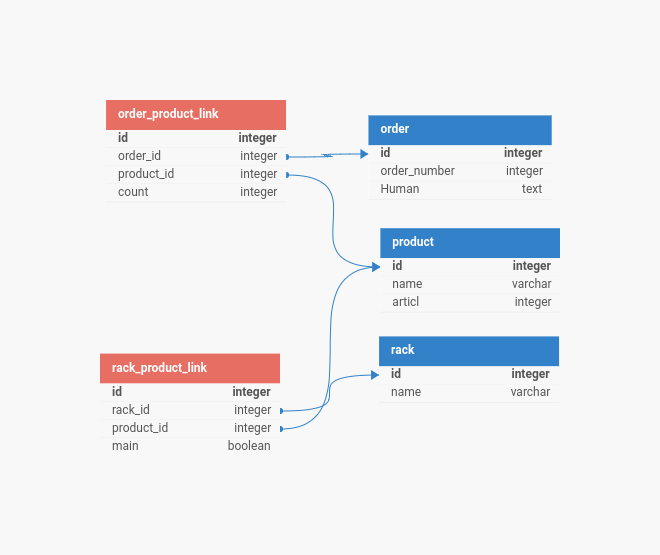

Описание задачи
Данное тестовое задание представляет собой создание консольной программы для управления сборкой заказов в интернет-магазине. Пользователь вводит номера заказов, и программа выводит список товаров, сгруппированных по главным стеллажам для эффективной сборки.

Структура Базы Данных

Для решения задачи необходимо создать таблицы в базе данных, которые будут хранить информацию о заказах, товарах и их распределении по стеллажам. Таблицы должны быть правильно спроектированы с учетом оптимального использования ресурсов и возможности легкой реализации другого функционала. В данном случае, нам понадобятся следующие таблицы:

Таблица orders
Хранит информацию о заказах, включая их номер и дополнительные данные.

Таблица products
Содержит информацию о товарах, такую как название и уникальный идентификатор.

Таблица rack
Хранит данные о стеллажах, их названия. 

Таблица order_products
Связующая таблица, отображающая соответствие между заказами и товарами, а также количество товаров в каждом заказе.

Таблица rack_products
Связующая таблица, отображающая распределение товаров по стеллажам, включая информацию о главных и дополнительных стеллажах. 

2- чтобы мигрировать БД нужно использовать команду python migrate.py В базе данных появится 5 таблиц. 